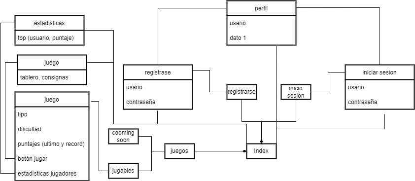

# Presupuesto de trabajo, grupo:14, division:B 

## Integrantes
- Ivan Lautaro Sanchez
- Federico Ignacio Alegre
- Solana Carolina Perez Righentini
- Martina Belen Fiotto

## Nombre de la propuesta
ODSgames

## propuesta
#### ODS elegidos como prioridad: 2, 5, 7
Realizar una interfaz de minijuegos sobre cada ODS. En principio para evitar hacer un proyecto extenso se van a hacer propuestas sobre los ODS elegidos arriba, dejando la posibilidad de en un futuro extender las posibilidades a demás ODS.
Dentro de los ODS elegidos también haremos distintos tipos de dificultad en cuestión de desarrollo. En una primera instancia se van a priorizar juegos simples. (crucigramas, sopa de letras, quiz, etc) y en caso de poder contar con el tiempo, crear un minijuego más desarrollado (juego tipo flash, mecánicas simples sin mucho extension en cuanto a niveles)

## Estructura

## Wireframe
[Wireframe](wireFrame.md)

## Tareas
1. Investigación y redacción de consignas y sus respuestas
2. Diseño de imagen y de la UI
3. Diseño de la base de datos 
4. Funciones de interacción con la base (API, Flask) 
5. Front-end del juego (HTML, CSS, JS)
6. Testeo 
7. Puesta en producción

### responsabilidades
- Sanchez (3, 2, 5)
- Alegre (7, 5)
- Perez (4, 6)
- Fiotto (1, 6)

[inicio](README.md)
