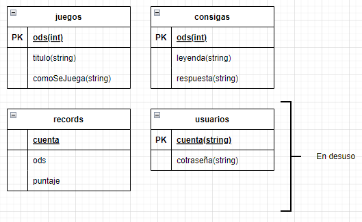

# G14-TPI-1CUAT
## Presupuesto
[Documento de alcance](PRESUPUESTO.md)

## Interfaz de usuario
[Hoja de Estilo](hojaDeEstilo.md)\
[Wireframe](wireFrame.md)

## Consignas
[Crucigrama](crucigrama.md) \
[Verdadero o Falso](verdaderoFalso.md) \
[Sopa de Letras](sopaDeLetras.md)

## Base de Datos
### DER

## Aplicacion en flask
[aplicacion](http://falegre22.pythonanywhere.com/)
[archivos]()
